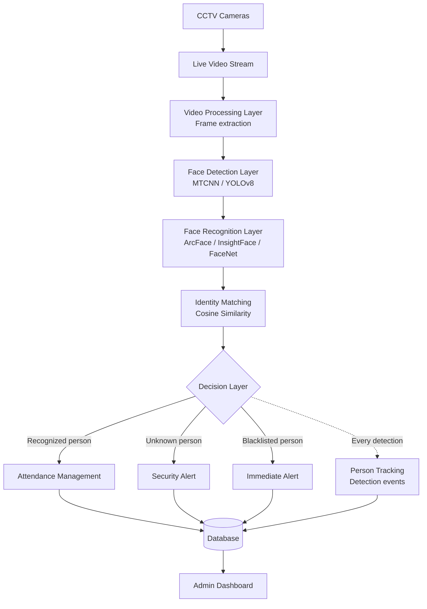

# Smart Attendance and Security System

> **Full title:** Smart Attendance and Security System Using Face Recognition and CCTV Surveillance
>
> **Legend used in this document**
> - **[Specified]**: part of the project definition itself.
> - **[Proposed]**: a logical requirement or design choice needed to build the system, but not explicitly specified. Treat it as a recommendation, not an existing implementation.
> - **[Future]**: a possible extension. Not part of the current project scope.

---

## 1. Project Overview

The Smart Attendance and Security System is an intelligent platform designed for **educational institutions**. It combines five capabilities into one unified system:

1. **Automated attendance management**
2. **Real-time CCTV surveillance**
3. **Facial recognition**
4. **Security alerts**
5. **Person tracking**

The system reads live video from CCTV cameras, detects faces in the video, and identifies each person by comparing their face against a database of registered people. Depending on who is identified, the system does one of three things:

- **Recognized person:** attendance is marked automatically, and the face is shown with a green bounding box and the person's name.
- **Unknown person:** the face is shown with a red bounding box labelled "Unknown", and a security alert can be triggered.
- **Blacklisted person:** an immediate security alert is generated.

Every detection is also stored as a tracking record (person, camera, location, timestamp), so an administrator can later search for a person and see their movement history and last known location. All of this is presented through a **web-based admin dashboard**. The system is intended to support **multiple CCTV cameras across different campus locations**.

---

## 2. Problem Statement

### 2.1 Problems with traditional attendance systems

Traditional attendance (roll calls, paper registers, sign-in sheets) has several weaknesses:

- **Manual and time-consuming.** Faculty spend part of every class on attendance instead of teaching.
- **Prone to human error.** Records can be entered incorrectly, lost, or maintained inconsistently.
- **Vulnerable to proxy attendance.** One person can mark attendance on behalf of another, since nothing verifies the person's actual presence.

### 2.2 Security problems on campus

- Colleges may not have an **integrated system** that can identify unknown or unauthorized people at different campus locations.
- CCTV cameras usually only *record* footage. Someone must watch or review it manually, so unauthorized entry can go unnoticed.
- There is typically no easy way to find **where a particular person was last seen** across several cameras.

### 2.3 What the project aims to solve

The project addresses both sets of problems with a single platform: automatic, identity-verified attendance and real-time identification of unknown or blacklisted individuals, with centralized records.

---

## 3. Proposed Solution

The system is built on one core capability: **identifying people from live CCTV video using their faces**. This capability is reused for several purposes.

| Capability | How the system provides it |
|---|---|
| **Automated attendance** | When a registered person is recognized, an attendance record is created automatically with identity, date, time and location. |
| **Face recognition** | Each detected face is converted into a numerical *embedding* and compared against stored embeddings of registered people. |
| **CCTV surveillance** | Live video streams from campus cameras are processed continuously instead of being only recorded. |
| **Unknown-person detection** | If a face matches no registered person, it is flagged as "Unknown" (red box). |
| **Security alerts** | Unknown and blacklisted detections can raise alerts. Blacklisted people raise an immediate alert. |
| **Person tracking** | Every detection event (name, camera, location, timestamp) is stored, enabling movement history and last-known-location search. |
| **Admin dashboard** | A web interface shows attendance reports, unknown detections, alerts, tracking data and other records. |

**Main innovation [Specified]:** Many existing systems focus on *either* automated attendance *or* CCTV/security monitoring. This project combines both into a single platform, together with real-time CCTV recognition and person tracking.

---

## 4. How the System Works

### 4.1 Overall flow

```
CCTV Camera
  → Video Stream
  → Face Detection
  → Face Recognition
  → Identity Matching
  → Decision Making
  → Attendance / Security Alert
  → Database
  → Admin Dashboard
```

### 4.2 Step-by-step explanation

**Step 1. CCTV Camera.**
Cameras installed in classrooms, corridors, entrances and other campus locations capture live footage. Each camera has an identity (camera number) and a known location, which is later attached to every record it produces.

**Step 2. Video Stream.**
The live feed is received by the system as a continuous stream (RTSP is the proposed streaming protocol for CCTV). The stream is broken into individual **frames** (still images) that can be analyzed one at a time.

**Step 3. Face Detection.**
Each frame is scanned to find where faces are. The output is a bounding box (position and size) for each face. Proposed technologies are **MTCNN** or **YOLOv8**, used together with **OpenCV**. Detection answers only *"Is there a face here, and where?"* It does not say whose face it is.

**Step 4. Face Recognition.**
Each detected face is cropped and passed to a recognition model (**InsightFace with ArcFace**, or **FaceNet**). The model converts the face into a **face embedding**, a numerical vector that represents the face's distinguishing features.

**Step 5. Identity Matching.**
The new embedding is compared against the stored embeddings of registered people using **Cosine Similarity**. The closest match is found, and its similarity score is checked against a threshold [Proposed: the threshold value must be chosen and tuned during testing; no value is specified here].

**Step 6. Decision Making.**
Based on the matching result, one of three outcomes occurs:

| Outcome | Action |
|---|---|
| Match found | Identify the person → green bounding box with name → mark attendance |
| No match | Display "Unknown" in a red bounding box → generate a security alert |
| Match is a blacklisted person | Generate an immediate security alert |

**Step 7. Attendance / Security Alert.**
- For recognized people, an **attendance record** is created with identity, date, time and location.
- For unknown or blacklisted people, a **security alert** is created.

**Step 8. Database.**
Attendance records, alerts and **detection events** (person, camera, location, timestamp) are stored. Detection events from all cameras form the person-tracking history.

**Step 9. Admin Dashboard.**
Administrators use the web dashboard to view attendance reports, unknown-person detections, security alerts and tracking information, to search for individuals, and to export data.

---

## 5. Main Features

### 5.1 Real-time face recognition
Faces in live CCTV video are detected and identified as the video plays, so results appear on screen with names and coloured boxes while people are in view.

### 5.2 Automated attendance
Attendance is marked without any manual action. Each record carries the student's identity, date, time and location.

### 5.3 Unknown-person detection
A face that does not match any registered person is labelled "Unknown" with a red bounding box and can trigger a security alert.

### 5.4 Blacklisted-person alerts
If a detected face matches an entry on the blacklist, the system generates an **immediate** alert, with higher urgency than the unknown-person case.

### 5.5 Person tracking
Each detection event stores the person's name, camera number, location and timestamp. This allows an administrator to look up a person's movement history and last known location.

### 5.6 Timestamp and location recording
Every attendance record and detection event is stamped with the time and the camera's location, so each record answers *who, when and where*.

### 5.7 Multiple CCTV camera support
The system is designed to handle several cameras across different campus locations at the same time.

### 5.8 Web-based dashboard
Administration is done through a browser, so no special software has to be installed on the administrator's machine.

### 5.9 Reports and data export
Attendance reports, alert logs and tracking logs can be viewed, searched and exported.

---

## 6. Face Detection

### 6.1 What face detection means

Face detection is the task of **finding faces in an image or video frame**. For each face it returns a rectangular region (bounding box) showing where the face is. It does not identify the person.

### 6.2 How it works in this project

1. The system receives live CCTV video and splits it into frames.
2. Each frame is passed to a face detector.
3. The detector returns zero, one or many face regions per frame (a classroom frame may contain many faces).
4. Each face region is cropped and sent to the recognition stage.

### 6.3 Proposed technologies

| Technology | Role |
|---|---|
| **MTCNN** (Multi-task Cascaded Convolutional Networks) | A multi-stage neural network that proposes candidate face regions, refines them, and can also locate facial landmarks (eyes, nose, mouth corners), which are useful for alignment. |
| **YOLOv8** | A fast, single-pass object detector that can be trained or configured to detect faces, and is often chosen when real-time speed matters. |
| **OpenCV** | Library used to read video streams, handle frames, resize and draw bounding boxes and labels. |

The project names MTCNN **or** YOLOv8 as the detector. The final choice is an implementation decision [Proposed: compare both on sample CCTV footage for speed and reliability].

---

## 7. Face Recognition

### 7.1 Face embeddings
A face embedding is a list of numbers (a vector) produced by a neural network from a face image. The network is trained so that images of the **same person** produce vectors that are **close together**, and images of **different people** produce vectors that are **far apart**. The system therefore compares numbers instead of comparing raw images.

### 7.2 ArcFace / InsightFace or FaceNet
- **InsightFace with ArcFace** is a face-recognition toolkit and model family that produces discriminative embeddings.
- **FaceNet** is an alternative embedding model that serves the same purpose.

The project proposes one of these; the choice is an implementation decision.

### 7.3 Stored facial data
During registration, face images (approximately **30–50 per person**, from different angles and lighting) are collected. Embeddings are generated and stored with the person's details. These stored embeddings are the reference "known faces".

### 7.4 Cosine similarity
Cosine similarity measures how similar two embeddings are by looking at the **angle** between the two vectors.

- A value near **1** means the vectors point in nearly the same direction (very similar faces).
- A value near **0** or below means the faces are dissimilar.

```
cosine_similarity(A, B) = (A · B) / (‖A‖ × ‖B‖)
```

### 7.5 Identity matching
1. Generate the embedding for the detected face.
2. Compute cosine similarity against stored embeddings.
3. Take the best-scoring registered person.
4. If the score passes the threshold, the person is recognized; otherwise the face is "Unknown". [Proposed: threshold chosen through testing.]

### 7.6 Face detection vs. face recognition

| | Face Detection | Face Recognition |
|---|---|---|
| **Question answered** | *Is there a face, and where?* | *Whose face is it?* |
| **Input** | Full image / video frame | Cropped (and aligned) face |
| **Output** | Bounding box(es), optionally landmarks | Identity (or "Unknown") |
| **Technologies here** | MTCNN / YOLOv8 | ArcFace / InsightFace / FaceNet + cosine similarity |
| **Order in pipeline** | First | Second, after detection |

Detection must happen before recognition: the system first locates the face, then identifies it.

---

## 8. Attendance System

### 8.1 How attendance is generated

Once a face is recognized as a registered student:

1. The student's identity is obtained from the matched record.
2. The current **date** and **time** are captured.
3. The **location** is taken from the camera that saw the student.
4. An **attendance record** is stored in the database.

### 8.2 What each record contains

| Field | Meaning |
|---|---|
| Student identification | Name and ID of the recognized student |
| Date | Calendar date of the detection |
| Time | Time of the detection |
| Location | Campus location of the camera that captured the student |

### 8.3 Handling repeated detections [Proposed]
A student visible for several minutes will be detected in many consecutive frames. The system should avoid creating duplicate records, for example by marking attendance only once per student per class/session. The exact rule is not specified and must be defined during development.

### 8.4 Prevention of proxy attendance
Attendance is tied to the **face captured live by the camera**, not to a signature or a spoken name. Another person cannot answer for the student; the system only marks someone present when that person's own face is recognized. Anyone not registered is shown as "Unknown" and does not receive attendance.

---

## 9. Security System

### 9.1 How each type of person is handled

| Type | System behaviour |
|---|---|
| **Recognized individual** | Green bounding box with the person's name; attendance is marked; the detection is logged. |
| **Unknown individual** | Red bounding box labelled "Unknown"; a security alert can be triggered; the event is logged. |
| **Blacklisted individual** | Immediate security alert is generated; the event is logged. |

### 9.2 Visual feedback

- **Green bounding box + person's name:** recognized individual.
- **Red bounding box + "Unknown":** unrecognized individual.
- **Immediate alert:** for blacklisted individuals. [Proposed: the form of the alert, such as an on-screen notification, dashboard entry, sound, email or SMS, is not specified and should be selected during design.]

### 9.3 Alerts
Alerts are stored and shown in the admin dashboard so that security staff can review them.

---

## 10. Person Tracking

Person tracking is built from **detection events**. Every time a person is detected by any camera, the system stores:

| Recorded item | Purpose |
|---|---|
| **Person name** | Who was detected |
| **Camera number** | Which camera saw them |
| **Location** | Where that camera is installed |
| **Timestamp** | When they were seen |

### 10.1 Movement history
Sorting a person's detection events by time gives a trail of the cameras and locations where they were seen, i.e., their **movement history**.

### 10.2 Last known location
The most recent detection event for a person gives their **last known location**.

### 10.3 How an administrator uses it
The administrator searches for a person in the dashboard and retrieves their movement history and last known location across all available cameras.

> **Note:** This tracking is based on *recognition events at cameras*. It shows where a person was detected, not a continuous path between cameras.

---

## 11. Admin Dashboard

The dashboard is a **web-based** interface for administrators. It should provide:

| Section | Information provided |
|---|---|
| **Attendance reports** | Detailed attendance records (student, date, time, location) |
| **Attendance summaries** | Aggregated views of attendance |
| **Unknown-person detections** | List of unrecognized faces detected, with camera, location and time |
| **Security alerts** | Alerts for unknown and blacklisted persons |
| **Person tracking** | Movement history and last known location |
| **Search** | Find a particular person or record |
| **Data export** | Export reports and logs for use elsewhere |

---

## 12. System Architecture

### 12.1 Components

### CCTV Camera Layer
The physical cameras placed in different campus locations. They produce the live video. Each camera is identified by a camera number and mapped to a location.

### Video Processing Layer
Receives the camera streams (RTSP proposed) and extracts frames using OpenCV. It also prepares frames for detection (e.g., resizing). It must handle several streams for a multi-camera deployment.

### Face Detection Layer
Finds faces in each frame using MTCNN or YOLOv8 and outputs cropped faces with bounding boxes.

### Face Recognition Layer
Generates embeddings (ArcFace/InsightFace or FaceNet) and compares them with stored embeddings using cosine similarity.

### Decision Layer
Interprets the matching result and decides whether the person is recognized, unknown or blacklisted, then triggers the right action.

### Attendance Management
Creates and stores attendance records (identity, date, time, location) for recognized people.

### Security & Alert System
Creates alerts for unknown persons and immediate alerts for blacklisted persons.

### Person Tracking
Stores each detection event (name, camera, location, timestamp) to support movement history and last-known-location queries.

### Database
Central store for student details, face embeddings, attendance records, detection events, alerts, blacklist information and camera details.

### Admin Dashboard
Web interface that presents information from the database and supports search and export.

### 12.2 Component interaction



---

## 13. Data Flow

### 13.1 Data entering the system
- **Live video** from CCTV cameras.
- **Registration data** for each person: name, ID, department, year, and 30–50 face images.
- **Blacklist entries** [Proposed: a way for administrators to add blacklisted persons' face data].

### 13.2 Processing and storage

```
Camera → Frame → Face → Embedding → Identity → Decision → Record/Alert → Dashboard
```

| Stage | What happens | What is stored |
|---|---|---|
| **Camera** | Captures live video | Nothing required at this stage |
| **Frame** | Video is split into individual frames | Frames are processed transiently |
| **Face** | Faces are detected and cropped | Face region used for next stage |
| **Embedding** | Face converted to a numerical vector | Embeddings stored only for *registered* people |
| **Identity** | Embedding compared with stored ones using cosine similarity | Match result (identity or unknown) |
| **Decision** | Recognized / unknown / blacklisted | Decision outcome |
| **Record/Alert** | Attendance record, security alert and detection event are created | Attendance, alerts, detection events |
| **Dashboard** | Data is read and displayed | None (read/display) |

> **[Proposed]:** Whether to save snapshots of unknown faces or video clips as evidence is not specified. If done, it raises storage and privacy considerations (see Section 21).

---

## 14. Data and Database Requirements

The following information needs to be stored. Specific table and column designs are **not** defined by the project and are therefore **[Proposed]** below.

| Data | What it holds | Status |
|---|---|---|
| **Student details** | Name, ID, department, year | [Specified] |
| **Face embeddings** | Numerical vectors from the 30–50 registered images per person | [Specified: embeddings are stored and compared] |
| **Attendance records** | Student identity, date, time, location | [Specified] |
| **Camera details** | Camera number, location, stream address | [Proposed: needed to link detections to locations] |
| **Detection events** | Person name, camera number, location, timestamp | [Specified] |
| **Location** | Campus location for each camera | [Specified] |
| **Timestamp** | Date/time of every record | [Specified] |
| **Security alerts** | Alert type (unknown/blacklisted), time, camera, location | [Proposed fields; alerts themselves are specified] |
| **Blacklist information** | Identity and face data of blacklisted persons | [Proposed fields; blacklist feature is specified] |

**Notes**
- The type of database (relational or otherwise) is **not specified** and is an implementation choice.
- Fields such as alert status (e.g., reviewed/unreviewed) or unique IDs for records are [Proposed] additions.

---

## 15. Technologies

| Technology / Component | Purpose |
|---|---|
| OpenCV | Video/image processing |
| MTCNN / YOLOv8 | Face detection |
| InsightFace / ArcFace | Face recognition |
| FaceNet | Face recognition alternative |
| Cosine Similarity | Face embedding comparison |
| RTSP | CCTV video streaming |
| Web Dashboard | Administration and reporting |
| Database | Store attendance, detection and tracking records |

> Specific web frameworks, programming language and database engine are **not specified** by the project. Any choices made for them are implementation decisions.

---

## 16. Complete User Workflow

### 16.1 Student
1. The student is **registered** once: name, ID, department, year and face images are collected.
2. During normal college life, the student simply enters a camera-monitored area such as a classroom.
3. The system recognizes the student and marks attendance automatically.
4. The student does not need to sign, answer a roll call, or press anything.

### 16.2 Faculty
1. Faculty teach without spending time on roll call.
2. Attendance for their class is generated automatically.
3. [Proposed] Faculty can view attendance reports for their classes through the dashboard, depending on the access rights granted.

### 16.3 Security / Admin
1. Monitors the **admin dashboard** for attendance, unknown-person detections and security alerts.
2. Receives an **immediate alert** when a blacklisted person is detected.
3. Reviews unknown-person detections and decides on action.
4. Searches for a person to see their **movement history and last known location**.
5. Exports reports and logs when needed.
6. Manages registered persons and the blacklist [Proposed].

---

## 17. Example Scenarios

### 17.1 Scenario A: A registered student enters a classroom

1. A student enters a classroom monitored by CCTV.
2. The camera captures the student.
3. The system detects the face in the frame.
4. The face is converted into an embedding.
5. The embedding is compared with the embeddings of registered students.
6. The student is recognized (a green box with their name appears on the video).
7. Attendance is marked with the time and location (the classroom camera's location).
8. The detection event is stored (name, camera number, location, timestamp).
9. The dashboard is updated to show the attendance record and the latest tracking information.

### 17.2 Scenario B: An unknown person enters the monitored area

1. A person who is not registered walks into a monitored corridor or entrance.
2. The camera captures their face and the system detects it.
3. An embedding is generated and compared with all registered embeddings.
4. No stored embedding is similar enough to pass the matching threshold.
5. The system labels the face **"Unknown"** and draws a **red bounding box**.
6. No attendance is marked.
7. A **security alert** is generated, and the detection event (camera, location, timestamp) is stored.
8. The alert and the unknown detection appear on the admin dashboard, where security staff can review them.

*(If the same person had been on the blacklist, step 7 would be an **immediate alert** instead.)*

---

## 18. Project Objectives

1. **Real-time recognition.** Detect and recognize faces in live CCTV streams as they happen.
2. **Automated attendance.** Mark attendance automatically with timestamp and location, removing manual roll calls.
3. **Visual feedback.** Show identification clearly: green bounding box with name for recognized people, red bounding box with "Unknown" otherwise.
4. **Security alerts.** Raise real-time alerts for unknown or blacklisted individuals.
5. **Person tracking.** Track people across multiple cameras using stored detection events.
6. **Web dashboard.** Provide web-based administration and reporting.
7. **Scalability.** Support multiple CCTV cameras and campus locations.

---

## 19. Expected Benefits

The expected outcome is a unified smart-campus solution. These are expected benefits, not measured results.

| Benefit | How the project helps |
|---|---|
| **Reduce manual attendance work** | Attendance is captured automatically from camera feeds. |
| **Reduce proxy attendance** | Attendance depends on the person's own face being recognized. |
| **Save faculty time** | No roll call is needed in class. |
| **Improve campus monitoring** | Cameras actively identify people instead of only recording. |
| **Detect unknown individuals** | Unrecognized faces are flagged in real time. |
| **Centralize records** | Attendance, alerts and tracking are held in one place. |
| **Enable person tracking** | Detection events give movement history and last known location. |

---

## 20. Implementation Plan

| Phase | Activities |
|---|---|
| **1. Requirement analysis** | Define users, campus locations, number of cameras, what must be recorded and what alerts are needed. |
| **2. Data collection** | Collect ~30–50 images per registered person from different angles and lighting; record name, ID, department and year. |
| **3. Image preprocessing** | Face alignment, resizing, brightness normalization, noise reduction and data augmentation for robustness. |
| **4. Face detection** | Implement detection on live CCTV frames using MTCNN or YOLOv8 with OpenCV. |
| **5. Face recognition** | Generate embeddings using ArcFace/InsightFace or FaceNet; implement cosine-similarity matching and the unknown threshold. |
| **6. Attendance module** | Create attendance records (identity, date, time, location) for recognized persons. |
| **7. Security alert module** | Implement unknown-person and blacklisted-person alerts and the green/red box display. |
| **8. Person tracking** | Store detection events from all cameras; implement search by person, movement history and last known location. |
| **9. Database integration** | Connect all modules to the database and finalize the data structures. |
| **10. Admin dashboard** | Build the web interface for reports, alerts, unknown detections, tracking, search and export. |
| **11. Testing and optimization** | Test under different lighting, angles and crowd conditions; tune thresholds and performance. |
| **12. Final deployment/demo** | Deploy with the intended cameras and demonstrate the complete system. |

---

## 21. Possible Challenges

> The challenges below are **reasonable implementation considerations** for a system of this type. They are **not requirements specified by the project**, and no performance figures are claimed.

| Challenge | Why it matters |
|---|---|
| **Different lighting conditions** | Very bright, dark or uneven light can reduce detection and recognition quality. Brightness normalization and varied training images help. |
| **Different face angles** | Faces turned sideways or looking down are harder to match. Collecting images from several angles helps. |
| **Multiple people in one frame** | Classrooms contain many faces; each must be detected and processed, which increases computation. |
| **CCTV video quality** | Low resolution, blur, distance and compression can hurt recognition. |
| **Recognition errors** | A person may be mistakenly recognized as someone else or not recognized at all. The matching threshold must be tuned and errors considered in how alerts are handled. |
| **Unknown faces** | Choosing the right similarity threshold is a balance: too strict gives false "Unknown" alerts, too lenient risks wrong identification. |
| **Real-time processing** | Detection plus recognition per frame needs sufficient processing power to keep up with live video. |
| **Multiple camera streams** | Handling many streams at once increases load; processing strategy must be planned for scalability. |
| **Data storage** | Records, embeddings and any saved images grow over time. |
| **Privacy and access control** | Face data is sensitive personal data. Access to it, to the dashboard, and to tracking information must be restricted and managed responsibly, and institutional/legal requirements should be followed. |

---

## 22. Future Scope

> **All items below are [Future] possibilities. They are not currently implemented and not part of the specified project.**

- **Notification channels:** sending alerts by email, SMS or mobile push to security personnel.
- **Liveness detection:** detecting whether a real person (rather than a photo or video of one) is in front of the camera, to strengthen proxy-prevention.
- **Mobile application:** a companion app for admins or faculty to view reports and alerts.
- **Analytics:** attendance trends, low-attendance reports, crowd or footfall analysis based on stored data.
- **Role-based access:** separate dashboard permissions for administrators, faculty and security staff.
- **Integration** with an existing college management / student information system.
- **Improved tracking:** richer multi-camera movement visualization (e.g., on a campus map).
- **Performance scaling:** distributed or GPU-based processing for a larger number of cameras.

---

## 23. Conclusion

The Smart Attendance and Security System brings attendance management, CCTV surveillance, security alerts and person tracking together in one intelligent platform. Live camera video is processed to detect faces, convert them to embeddings and match them against registered people. The outcome of each match drives the response: attendance is recorded for recognized people, and alerts are raised for unknown or blacklisted individuals. Every detection is also stored to support tracking, and all information is centralized in a web-based admin dashboard. The result is a unified smart-campus solution that reduces manual attendance work, helps prevent proxy attendance, provides real-time identification of unknown individuals, maintains movement records, and gives administrators one place to monitor attendance and security.

---

## 24. Quick Project Explanation

# Quick Explanation for Viva

**What is the project?**
A smart campus system that uses CCTV cameras and face recognition to automatically mark attendance and to watch for unknown or unauthorized people. It also tracks where people were seen and shows everything on a web dashboard.

**What problem does it solve?**
Manual attendance is slow, error-prone and allows proxy attendance. Also, colleges often lack a system that can identify unknown people across campus. This project solves both with one platform.

**Why is facial recognition used?**
A face is unique to each person and the camera can read it without any action from the person. It lets the system confirm who is actually present, which makes automatic attendance and proxy prevention possible.

**What is the difference between face detection and face recognition?**
Detection finds *where* a face is in the image. Recognition finds *whose* face it is. Detection comes first, and then recognition is applied to each detected face.

**How is attendance marked?**
When a registered student's face is recognized, the system automatically stores their identity along with the date, time and location of the camera that saw them.

**How does the CCTV system work?**
Cameras send live video. The system splits it into frames, detects faces, converts each face to an embedding, compares it with stored embeddings using cosine similarity, and decides what to do. Recognized faces get a green box and name; unknown faces get a red box saying "Unknown".

**How are unknown people detected?**
If a face's embedding does not match any registered person closely enough, it is treated as unknown. It gets a red box labelled "Unknown" and can trigger a security alert.

**What happens when a blacklisted person is detected?**
The system generates an immediate security alert, and the event is stored and shown in the dashboard.

**How does person tracking work?**
Every detection stores the person's name, camera number, location and time. Putting these records in time order shows the person's movement history, and the latest one gives their last known location.

**What is the role of the database?**
It stores student details, face embeddings, attendance records, detection events, alerts, camera details and blacklist data, so everything is kept in one centralized place.

**What is the role of the admin dashboard?**
It is the web interface where administrators view attendance reports, unknown detections, alerts and tracking information, search for people, and export data.

**What is the main innovation of the project?**
Most existing systems do *either* automated attendance *or* security monitoring. This project combines both in one platform, along with real-time CCTV recognition and person tracking.
