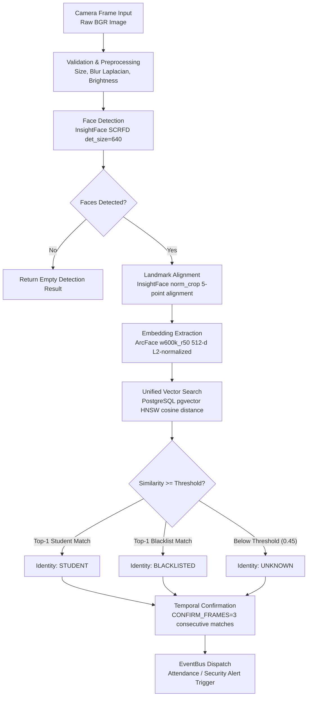

# AI Vision Engine Architecture

**Model Package:** InsightFace `buffalo_l` (SCRFD detector + ArcFace `w600k_r50` recognizer)  
**Execution Provider:** `onnxruntime` CPU (`DEVICE=cpu`)  
**Embedding Vector Dimension:** 512-dimensional, L2-normalized float array  
**Vector Similarity Operator:** Cosine similarity (`1 - (a <=> b)`)  

---

## 1. Vision Pipeline Flow



---

## 2. Shared AI Engine Principle

Attendance and Security modules do **NOT** duplicate face detection or embedding generation. Both modules consume outputs from the single `VisionPipeline`:

```text
CAMERA → FRAME → FACE DETECTION → PREPROCESS/ALIGN → EMBEDDING → VECTOR SEARCH (pgvector)
      → IDENTITY DECISION ─┬─ KNOWN (normal)  → Attendance + Detection Event (movement)
                           ├─ UNKNOWN         → Detection Event + configurable Security Alert
                           └─ BLACKLISTED     → Detection Event + HIGH/CRITICAL Security Alert
```

---

## 3. Preprocessing & Quality Validation

Before face images are sent to ArcFace embedding extraction, frames pass quality checks:

1. **Format Validation:** Verified JPEG/PNG magic bytes; dimensions within valid resolution boundaries.
2. **Min Face Size Guard:** Face bounding box width and height must be `≥ MIN_FACE_PIXELS` (default 80 pixels).
3. **Blur Detection:** Laplacian variance of face crop `≥ BLUR_THRESHOLD` (default 100.0). Sharpness failure rejects frame.
4. **Brightness Normalization:** Optional CLAHE (Contrast Limited Adaptive Histogram Equalization) and brightness checks.

---

## 4. Face Registration & Embedding Consistency

Registration collects 30–50 samples per candidate across varied head poses and lighting conditions:

1. **Quality Filtering:** Each sample frame must pass detection, min size, and blur validation.
2. **Consistency Check:** Each candidate sample embedding $e_i$ is compared against the median embedding vector $\bar{e}$ of the collection:
$$\text{cosine\_similarity}(e_i, \bar{e}) \ge 0.50$$
Outlier samples failing consistency are automatically discarded.
3. **Multi-Sample Storage:** All accepted L2-normalized embeddings for a student are stored in `face_embeddings`. Storing multiple pose angles ensures high recognition accuracy across non-frontal CCTV views.

---

## 5. Temporal Confirmation (`CONFIRM_FRAMES`)

To prevent false positive triggers caused by transient frame blur, lighting glitches, or occlusion:

- Every face detection track maintains a short frame buffer.
- The pipeline requires `CONFIRM_FRAMES=3` consecutive matching identity decisions on the same track before triggering an attendance mark or raising a security alert.

---

## 6. Threshold Calibration Methodology

The shipped default `RECOGNITION_THRESHOLD=0.45` is a starting baseline. Before production deployment:

1. **Evaluation Script:** `scripts/calibrate_threshold.py` processes local git-ignored benchmark datasets (`tests/fixtures_local/`).
2. **Distribution Metrics:** Computes Genuine Acceptance Rate (GAR), False Acceptance Rate (FAR), and False Rejection Rate (FRR) across cosine similarity thresholds from `0.20` to `0.80`.
3. **Optimal Threshold Selection:** Selects the threshold yielding Equal Error Rate (EER) or targeting $\text{FAR} \le 0.01\%$.
