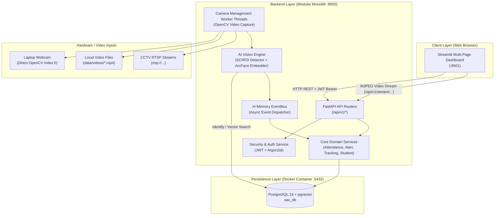

# System Architecture Overview

**System Name:** Smart Attendance and Security System  
**Architecture Pattern:** Modular Monolith (`backend/` + `frontend/`)  
**Execution Environment:** Laptop Webcam MVP (CPU-First, `DEVICE=cpu`)  

---

## 1. Executive Summary & Design Principles

The Smart Attendance and Security System is an integrated, identity-verified platform for educational institutions. It unifies **Automated Attendance** and **Campus Security Monitoring** on top of a single, shared **AI Vision Engine**.

### Core Architectural Principles
1. **Modular Monolith:** Single deployment artifact containing `backend/` (FastAPI) and `frontend/` (Streamlit). No microservices, Kafka, or distributed message buses for MVP.
2. **One Vision Engine, Two Consumers:** Attendance and Security modules consume the same detection, embedding, and recognition pipeline. Facial detection and recognition logic are never duplicated.
3. **CPU-First Execution:** Default inference runs on CPU (`onnxruntime` CPU execution provider, `DEVICE=cpu`). GPU is an optional post-MVP enhancement.
4. **Singleton AI Models:** Neural networks (`InsightFace buffalo_l` pack) are loaded into memory **once** via a `ModelRegistry` thread-safe singleton, never instantiated per frame or request.
5. **pgvector Vector Database:** Identity matching is executed inside PostgreSQL 16 using the `pgvector` extension with HNSW cosine distance indexes (`vector_cosine_ops`).
6. **Data Minimization & Privacy:** No biometric face images are persisted after embedding extraction (`RETAIN_RAW_IMAGES=false`). Raw embeddings are encrypted at rest and never exposed via any API endpoint.

---

## 2. High-Level Architecture (System Context)



---

## 3. Layered Process Model (MVP)

```text
[ Streamlit :8501 ] --HTTP/JWT--> [ FastAPI :8000 ] --SQL--> [ PostgreSQL+pgvector :5432 (Docker) ]
                                     |  ^
                                     |  +-- MJPEG /api/v1/stream/{camera}?ticket=...
                                     v
                        [ CameraWorker thread(s) ]  → [ VisionPipeline (model loaded once) ]
                                     |                      → EventBus → Attendance / Security / Movement handlers
                               Laptop webcam (OpenCV)
```

---

## 4. Risks & Mitigations

| Risk / Challenge | Severity | Mitigation Strategy |
|---|---|---|
| **Windows OpenCV Webcam Access in Docker** | High | Backend runs directly on host OS (Python 3.11) during MVP development. PostgreSQL+pgvector runs in Docker. Full Dockerization (Phase 36) uses RTSP / video file streams. |
| **InsightFace ONNX Runtime Windows Build** | Medium | Use `onnxruntime` CPU explicitly pinned `<1.20.0` with Python 3.11 virtual environment. `numpy` is strictly pinned `<2.0.0`. |
| **Cosine Threshold Calibration** | High | Shipped default `RECOGNITION_THRESHOLD=0.45` is a starting baseline. `scripts/calibrate_threshold.py` evaluates genuine vs. impostor distributions on local fixtures to optimize FAR/FRR. |
| **False Positives in Video Stream** | Medium | Temporal confirmation requiring `CONFIRM_FRAMES=3` consecutive matches on the same face track before triggering attendance or alerts. |
| **Biometric Privacy & Compliance** | Critical | Explicit consent recorded (`consent_given_at`). Raw face images deleted from memory after embedding creation. Withdrawal endpoints hard-delete face vectors. |

---

## 5. Phase 0 Audit Reconciliation & Alignment

1. **Python Version:** Audit revealed system Python 3.14.4 active on PATH. Phase 2 environment setup will explicitly configure a Python 3.11 virtual environment (`.venv`).
2. **Docker Dependency:** Docker CLI missing on PATH in audit. Docker Desktop will be launched before Phase 3 (Database container setup).
3. **Database Credentials:** Standardized to `POSTGRES_USER=sas_user` and `POSTGRES_DB=sas_db` per Playbook Section 6.
4. **Argon2id Hashing:** `argon2-cffi` added to requirements for secure password hashing.
