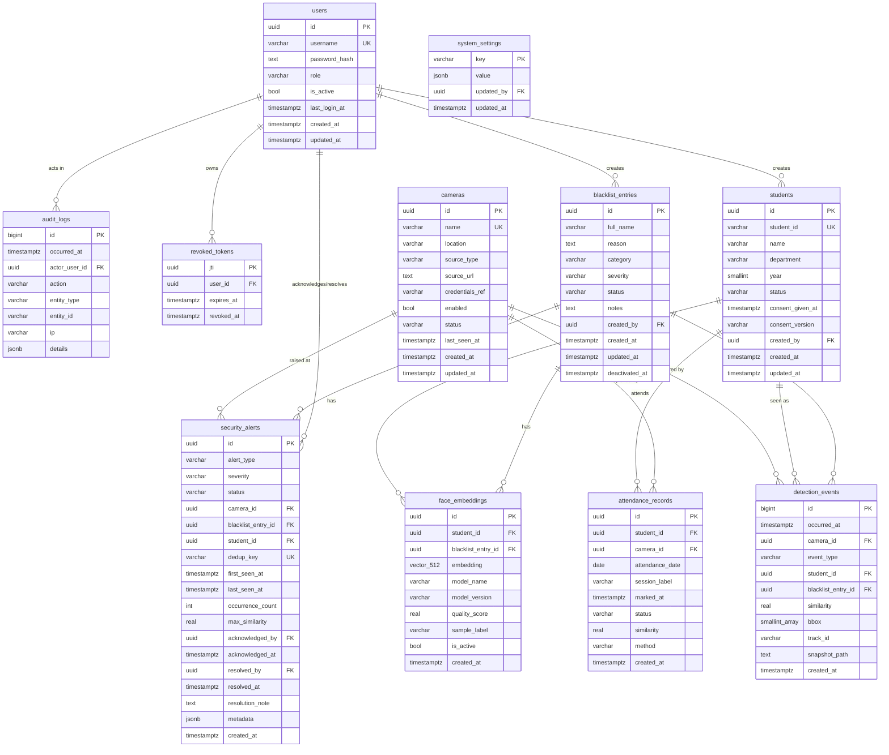

# Database Specification & Schema Design

**Database Engine:** PostgreSQL 16  
**Vector Extension:** `pgvector`  
**Primary Key Strategy:** UUID (`gen_random_uuid()`) for entities; BigInt (`IDENTITY`) for high-volume logs  
**Timestamp Standard:** UTC `timestamptz` everywhere  
**ORM / Migration Framework:** SQLAlchemy 2.x + Alembic  

---

## 1. Entity-Relationship (ER) Diagram



---

## 2. Table Specifications

### 2.1 `users`
- **Purpose:** System admin and operator user accounts.
- **PK:** `id uuid DEFAULT gen_random_uuid()`
- **Columns:**
  - `username varchar(64) NOT NULL UNIQUE`
  - `email varchar(255) NULL UNIQUE`
  - `password_hash text NOT NULL` (Argon2id)
  - `role varchar(16) NOT NULL CHECK (role IN ('ADMIN', 'OPERATOR'))`
  - `is_active boolean NOT NULL DEFAULT true`
  - `last_login_at timestamptz NULL`
  - `created_at timestamptz NOT NULL DEFAULT now()`
  - `updated_at timestamptz NOT NULL DEFAULT now()`
- **Retention:** Retained permanently; soft-deactivation via `is_active=false`.

### 2.2 `revoked_tokens`
- **Purpose:** Denylist for revoked JWT access tokens on logout.
- **PK:** `jti uuid PRIMARY KEY`
- **Columns:**
  - `user_id uuid NOT NULL REFERENCES users(id) ON DELETE CASCADE`
  - `expires_at timestamptz NOT NULL`
  - `revoked_at timestamptz NOT NULL DEFAULT now()`
- **Indexes:** `idx_revoked_tokens_expires (expires_at)`
- **Retention:** Cron purge job deletes rows where `expires_at < now()`.

### 2.3 `students`
- **Purpose:** Registered student profiles.
- **PK:** `id uuid DEFAULT gen_random_uuid()`
- **Columns:**
  - `student_id varchar(32) NOT NULL UNIQUE` (e.g. `STU001`)
  - `name varchar(120) NOT NULL`
  - `department varchar(80) NOT NULL`
  - `year smallint NOT NULL CHECK (year BETWEEN 1 AND 8)`
  - `status varchar(16) NOT NULL DEFAULT 'ACTIVE' CHECK (status IN ('ACTIVE', 'INACTIVE'))`
  - `consent_given_at timestamptz NULL`
  - `consent_version varchar(16) NULL`
  - `created_by uuid NULL REFERENCES users(id)`
  - `created_at timestamptz NOT NULL DEFAULT now()`
  - `updated_at timestamptz NOT NULL DEFAULT now()`
- **Indexes:** `idx_students_dept_year (department, year)`, `idx_students_name (lower(name))`

### 2.4 `blacklist_entries`
- **Purpose:** Blacklisted individuals for security monitoring.
- **PK:** `id uuid DEFAULT gen_random_uuid()`
- **Columns:**
  - `full_name varchar(120) NOT NULL`
  - `reason text NOT NULL`
  - `category varchar(40) NULL`
  - `severity varchar(16) NOT NULL DEFAULT 'HIGH' CHECK (severity IN ('HIGH', 'CRITICAL'))`
  - `status varchar(16) NOT NULL DEFAULT 'ACTIVE' CHECK (status IN ('ACTIVE', 'INACTIVE'))`
  - `notes text NULL`
  - `created_by uuid NULL REFERENCES users(id)`
  - `created_at timestamptz NOT NULL DEFAULT now()`
  - `updated_at timestamptz NOT NULL DEFAULT now()`
  - `deactivated_at timestamptz NULL`

### 2.5 `face_embeddings`
- **Purpose:** ArcFace 512-dimensional vector embeddings for students and blacklist entries.
- **PK:** `id uuid DEFAULT gen_random_uuid()`
- **Columns:**
  - `student_id uuid NULL REFERENCES students(id) ON DELETE CASCADE`
  - `blacklist_entry_id uuid NULL REFERENCES blacklist_entries(id) ON DELETE CASCADE`
  - `embedding vector(512) NOT NULL`
  - `model_name varchar(40) NOT NULL DEFAULT 'buffalo_l'`
  - `model_version varchar(40) NOT NULL DEFAULT 'w600k_r50'`
  - `quality_score real NULL`
  - `sample_label varchar(24) NULL`
  - `is_active boolean NOT NULL DEFAULT true`
  - `created_at timestamptz NOT NULL DEFAULT now()`
- **Constraints:** `CHECK ((student_id IS NOT NULL)::int + (blacklist_entry_id IS NOT NULL)::int = 1)`
- **Indexes:**
  - `idx_face_embeddings_hnsw ON face_embeddings USING hnsw (embedding vector_cosine_ops) WITH (m = 16, ef_construction = 64)`
  - `idx_face_embeddings_student (student_id)`
  - `idx_face_embeddings_blacklist (blacklist_entry_id)`
- **Security Rule:** **NEVER returned by any REST API endpoint.**

### 2.6 `cameras`
- **Purpose:** Camera location and stream source registry.
- **PK:** `id uuid DEFAULT gen_random_uuid()`
- **Columns:**
  - `name varchar(80) NOT NULL UNIQUE`
  - `location varchar(160) NOT NULL`
  - `source_type varchar(16) NOT NULL CHECK (source_type IN ('WEBCAM', 'VIDEO_FILE', 'RTSP'))`
  - `source_url text NULL` (Masked credentials)
  - `credentials_ref varchar(64) NULL`
  - `enabled boolean NOT NULL DEFAULT true`
  - `status varchar(16) NOT NULL DEFAULT 'UNKNOWN' CHECK (status IN ('UNKNOWN', 'ONLINE', 'OFFLINE', 'ERROR', 'DISABLED'))`
  - `last_seen_at timestamptz NULL`
  - `created_at timestamptz NOT NULL DEFAULT now()`
  - `updated_at timestamptz NOT NULL DEFAULT now()`

### 2.7 `attendance_records`
- **Purpose:** Attendance records for recognized students.
- **PK:** `id uuid DEFAULT gen_random_uuid()`
- **Columns:**
  - `student_id uuid NOT NULL REFERENCES students(id) ON DELETE RESTRICT`
  - `camera_id uuid NOT NULL REFERENCES cameras(id) ON DELETE RESTRICT`
  - `attendance_date date NOT NULL`
  - `session_label varchar(32) NOT NULL DEFAULT 'DEFAULT'`
  - `marked_at timestamptz NOT NULL DEFAULT now()`
  - `status varchar(12) NOT NULL DEFAULT 'PRESENT' CHECK (status IN ('PRESENT', 'LATE'))`
  - `similarity real NOT NULL`
  - `method varchar(8) NOT NULL DEFAULT 'AUTO' CHECK (method IN ('AUTO', 'MANUAL'))`
  - `created_at timestamptz NOT NULL DEFAULT now()`
- **Constraints:** `UNIQUE (student_id, attendance_date, session_label)`
- **Indexes:** `idx_attendance_date (attendance_date)`, `idx_attendance_student_date (student_id, attendance_date DESC)`

### 2.8 `detection_events`
- **Purpose:** Log of every accepted detection event (Recognized, Unknown, Blacklisted). Primary source for movement tracking.
- **PK:** `id bigint GENERATED ALWAYS AS IDENTITY PRIMARY KEY`
- **Columns:**
  - `occurred_at timestamptz NOT NULL`
  - `camera_id uuid NOT NULL REFERENCES cameras(id)`
  - `event_type varchar(12) NOT NULL CHECK (event_type IN ('RECOGNIZED', 'UNKNOWN', 'BLACKLISTED'))`
  - `student_id uuid NULL REFERENCES students(id) ON DELETE SET NULL`
  - `blacklist_entry_id uuid NULL REFERENCES blacklist_entries(id) ON DELETE SET NULL`
  - `similarity real NULL`
  - `bbox smallint[4] NULL`
  - `track_id varchar(40) NULL`
  - `snapshot_path text NULL`
  - `created_at timestamptz NOT NULL DEFAULT now()`
- **Indexes:**
  - `idx_events_occurred (occurred_at DESC)`
  - `idx_events_student_occurred (student_id, occurred_at DESC)`
  - `idx_events_camera_occurred (camera_id, occurred_at DESC)`
- **Retention:** Retention policy purge after `DETECTION_RETENTION_DAYS` (default 90).

### 2.9 `security_alerts`
- **Purpose:** Actionable security alerts.
- **PK:** `id uuid DEFAULT gen_random_uuid()`
- **Columns:**
  - `alert_type varchar(24) NOT NULL CHECK (alert_type IN ('UNKNOWN_PERSON', 'BLACKLISTED_PERSON', 'CAMERA_OFFLINE'))`
  - `severity varchar(10) NOT NULL CHECK (severity IN ('LOW', 'MEDIUM', 'HIGH', 'CRITICAL'))`
  - `status varchar(14) NOT NULL DEFAULT 'NEW' CHECK (status IN ('NEW', 'ACKNOWLEDGED', 'RESOLVED'))`
  - `camera_id uuid NOT NULL REFERENCES cameras(id)`
  - `blacklist_entry_id uuid NULL REFERENCES blacklist_entries(id)`
  - `student_id uuid NULL REFERENCES students(id)`
  - `dedup_key varchar(128) NOT NULL`
  - `first_seen_at timestamptz NOT NULL`
  - `last_seen_at timestamptz NOT NULL`
  - `occurrence_count integer NOT NULL DEFAULT 1`
  - `max_similarity real NULL`
  - `acknowledged_by uuid NULL REFERENCES users(id)`
  - `acknowledged_at timestamptz NULL`
  - `resolved_by uuid NULL REFERENCES users(id)`
  - `resolved_at timestamptz NULL`
  - `resolution_note text NULL`
  - `metadata jsonb NOT NULL DEFAULT '{}'`
  - `created_at timestamptz NOT NULL DEFAULT now()`
- **Indexes:**
  - Partial Unique Index: `CREATE UNIQUE INDEX idx_alerts_unresolved_dedup ON security_alerts (dedup_key) WHERE status <> 'RESOLVED'`
  - `idx_alerts_status_severity (status, severity, last_seen_at DESC)`

### 2.10 `audit_logs`
- **Purpose:** Immutable security and administrative audit trail.
- **PK:** `id bigint GENERATED ALWAYS AS IDENTITY PRIMARY KEY`
- **Columns:**
  - `occurred_at timestamptz NOT NULL DEFAULT now()`
  - `actor_user_id uuid NULL REFERENCES users(id)`
  - `action varchar(48) NOT NULL`
  - `entity_type varchar(32) NOT NULL`
  - `entity_id varchar(64) NULL`
  - `ip varchar(45) NULL`
  - `details jsonb NOT NULL DEFAULT '{}'` (**NO biometric data**)
- **Indexes:** `idx_audit_occurred (occurred_at DESC)`, `idx_audit_actor (actor_user_id, occurred_at DESC)`

### 2.11 `system_settings`
- **Purpose:** Key-value runtime configuration parameters.
- **PK:** `key varchar(64) PRIMARY KEY`
- **Columns:**
  - `value jsonb NOT NULL`
  - `updated_by uuid NULL REFERENCES users(id)`
  - `updated_at timestamptz NOT NULL DEFAULT now()`

---

## 3. Dynamic Movement History Model (ADR-09)

`movement_history` is **NOT** a physical table. It is constructed on-demand via the following query over `detection_events`:

```sql
SELECT 
    e.student_id,
    c.id AS camera_id,
    c.name AS camera_name,
    c.location,
    MIN(e.occurred_at) AS first_seen,
    MAX(e.occurred_at) AS last_seen,
    COUNT(*) AS frame_count,
    MAX(e.similarity) AS max_similarity
FROM detection_events e
JOIN cameras c ON e.camera_id = c.id
WHERE e.student_id = :student_id
  AND e.occurred_at BETWEEN :from_time AND :to_time
GROUP BY e.student_id, c.id, c.name, c.location
ORDER BY first_seen ASC;
```
