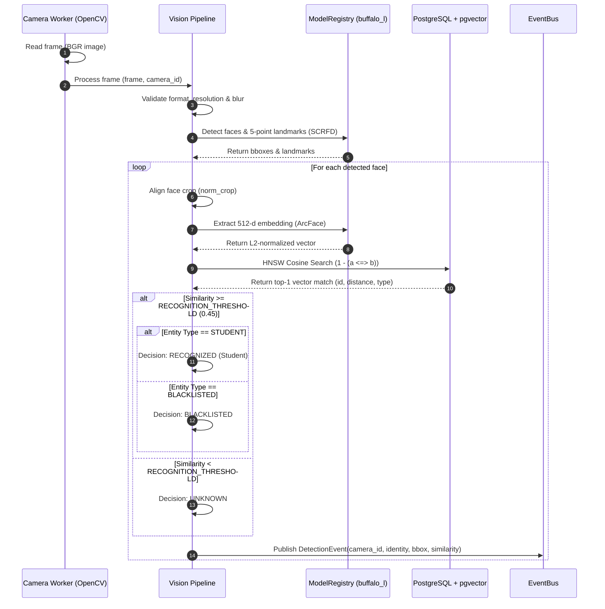
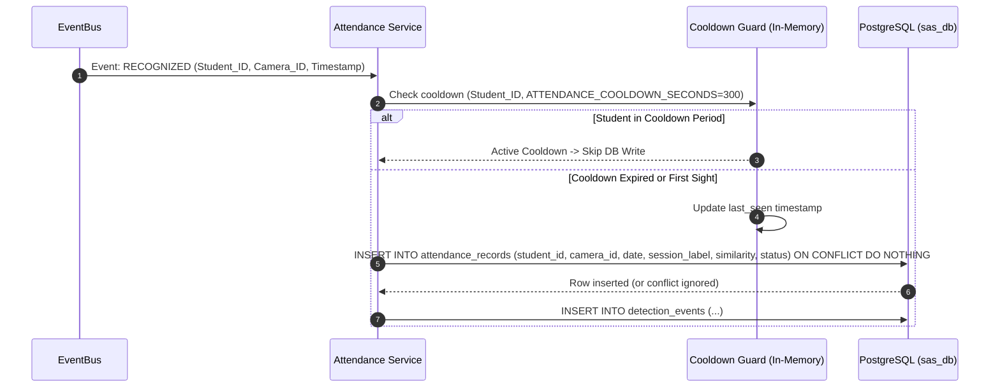
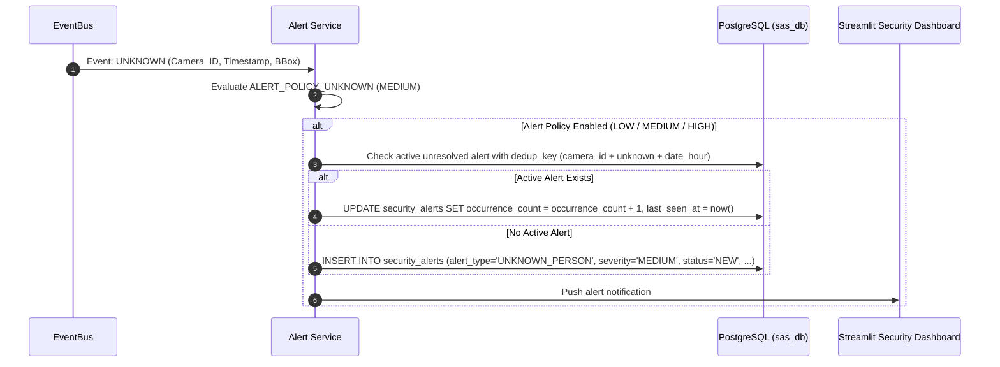
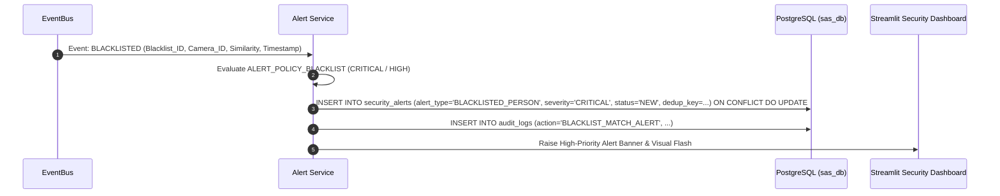
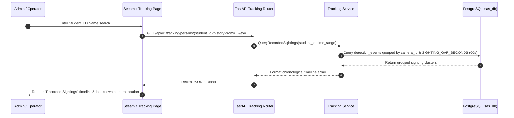

# End-to-End Data Flow Specifications

This document defines the complete data flows for frame processing, attendance marking, security alerts, and movement tracking.

---

## 1. Frame Processing & Identity Decision Flow

---

## 2. Attendance Marking Data Flow

---

## 3. Unknown Person Security Alert Data Flow

---

## 4. Blacklisted Person Immediate Alert Data Flow

---

## 5. Movement Tracking & Sightings Query Flow

