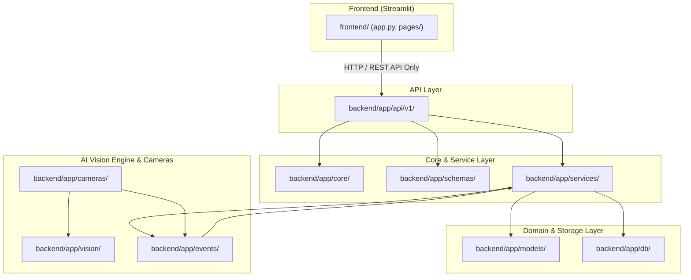

# Module Boundaries & Package Dependencies

This document establishes strict architectural boundaries, package structure, and import dependency rules for the modular monolith codebase.

---

## 1. Directory & Package Layout

```text
smart-attendance-security-system/
├─ backend/
│  ├─ app/
│  │  ├─ main.py                # FastAPI application entry point & router mounting
│  │  ├─ core/                 # App configuration, security, logging, errors, dependencies
│  │  ├─ db/                   # Database session management, base models, repositories
│  │  ├─ models/               # SQLAlchemy ORM model definitions (1 file per table)
│  │  ├─ schemas/              # Pydantic v2 request & response validation schemas
│  │  ├─ api/v1/               # FastAPI REST endpoint routers
│  │  ├─ services/             # Core business logic services (attendance, alert, tracking)
│  │  ├─ vision/               # SHARED AI ENGINE (detector, embedder, recognizer, pipeline)
│  │  ├─ cameras/              # Camera sources, worker threads, stream manager
│  │  └─ events/               # In-memory EventBus & event handlers
│  ├─ alembic/                 # Database migration scripts
│  ├─ alembic.ini              # Alembic configuration
│  └─ tests/                   # Unit, integration, database, vision, & security tests
├─ frontend/                   # Streamlit UI Dashboard
│  ├─ app.py                   # Streamlit entry point
│  ├─ api_client.py            # Centralized API HTTP client
│  ├─ pages/                   # Multi-page dashboard views
│  └─ components/              # Shared UI components & widgets
├─ scripts/                    # Utility, calibration, & benchmark scripts
├─ docker/                     # PostgreSQL init scripts & Dockerfiles
├─ docs/                       # System documentation & Playbook
│  ├─ architecture/            # Architecture blueprints & ADRs
│  └─ audit/                   # Audit reports
├─ data/                       # GIT-IGNORED transient storage (tmp, videos, snapshots)
└─ docker-compose.yml          # Infrastructure configuration
```

---

## 2. Strict Module Dependency Graph



---

## 3. Mandatory Import Dependency Rules

### Rule 1: Layer Directionality (`api` → `services` → `db` / `models`)
- Endpoint routers in `api/v1/` may ONLY import from `services`, `schemas`, and `core`.
- Routers MUST NOT execute raw SQL or direct database queries.

### Rule 2: Isolation of AI Vision Engine (`vision`)
- **`backend/app/vision/` MUST NEVER import from `backend/app/api/` or `backend/app/db/`.**
- The Vision Engine operates strictly on image arrays (`numpy.ndarray`), cropping, and vector embeddings. It has zero knowledge of HTTP endpoints, ORM sessions, or database models.

### Rule 3: Camera Capture Flow (`cameras`)
- `backend/app/cameras/` captures frames from video hardware/streams and passes frames to `vision.pipeline.VisionPipeline`.
- When identity decisions are produced, `cameras` dispatches events through `events.bus.EventBus`. It does NOT interact directly with database models or API routers.

### Rule 4: Event-Driven Processing (`events`)
- `events.bus.EventBus` dispatches events asynchronously to registered handlers in `services/`.
- Handlers in `services/` process attendance deduplication, security alerts, and detection event logging.

### Rule 5: Frontend Separation (`frontend`)
- `frontend/` MUST ONLY communicate with `backend/` via HTTP REST requests using `frontend/api_client.py`.
- `frontend/` MUST NOT import any backend modules (`backend/app/...`) directly.

---

## 4. Import Rule Automated Verification

Import boundary compliance is enforced via `flake8` and `pytest` AST import validation tests in Phase 34:

```powershell
# Verify no forbidden imports in vision module
pytest backend/tests/architecture/test_import_boundaries.py
```
